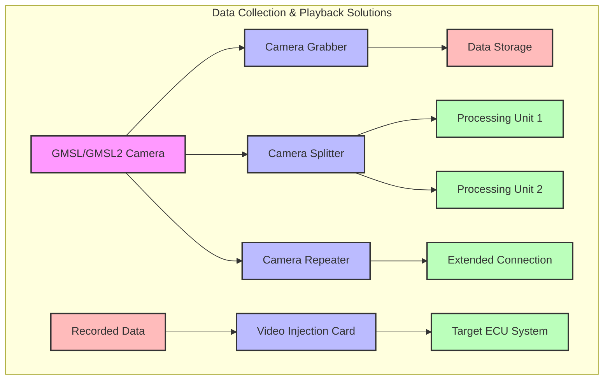

# Data Collection and Playback

## Overview

  

    This section covers specialized hardware and software solutions for camera data collection, distribution, and playback in automotive and embedded vision applications. These technologies enable efficient video data handling across multiple processing units while maintaining signal integrity and synchronization.
  

  

    :::note Key Components
    - GMSL Camera Grabber
    - GMSL2 Camera Repeater
    - GMSL2 Camera Splitter
    - GMSL Video Injection Card
    :::
  

## Solution Architecture

  

    

      

        <h3>Data Collection Path</h3>
      

      

        
Capture high-quality camera feeds using GMSL Camera Grabber for data collection and analysis. Distribute signals to multiple ECUs with Camera Splitter for parallel processing.

      

    

  

  

    

      

        <h3>Playback Path</h3>
      

      

        
Use the Video Injection Card to feed pre-recorded scenarios into vision systems for testing and validation. This enables repeatable testing with real-world data.

      

    

  

## Component Overview

### GMSL Camera Grabber

The Camera Grabber enables high-speed video capture from GMSL/GMSL2 cameras for data collection, testing, and development.

**[Learn more about GMSL Camera Grabber →](/docs/3_1_GMSL2_3_Camera_Grabber/Getting_Started/CCG3-8H.md)**

### GMSL2 Camera Repeater

Extends GMSL2 transmission distance with minimal signal degradation through one input to one output configuration.

**[Explore GMSL2 Camera Repeater →](/docs/3_2_GMSL2_Camera_Repeater/GMSL2_Camera_Repeater)**

### GMSL2 Camera Splitter

Distributes a single GMSL2 camera feed to multiple processing units while maintaining signal integrity and synchronization.

**[Discover GMSL2 Camera Splitter →](/docs/3_3_GMSL2_Camera_Splitter/GMSL2_Camera_Splitter)**

### GMSL Video Injection Card

Enables playback of pre-recorded video into automotive vision systems for testing and validation purposes.

**[Learn about Video Injection →](/docs/3_4_GMSL_Video_Injection_Card/Getting_Started/CIG3-8H.md)**

## Implementation Guide

1. **Select appropriate components** based on your specific data collection or playback requirements
2. **Configure the hardware** according to device-specific documentation
3. **Develop software interfaces** using provided example code and APIs
4. **Validate system performance** using recommended testing procedures

## Technical Comparison

| Component | Function | Max Resolution | Latency | Multiple Outputs | Key Feature |
|----------|----------|----------------|---------|-----------------|-------------|
| Camera Grabber | Data Collection | 4K (3840×2160) | Low | No | High-speed data capture |
| Camera Repeater | Signal Extension | 4K (3840×2160) | Ultra-low (< 10μs) | No | Distance extension |
| Camera Splitter | Signal Distribution | 4K (3840×2160) | Ultra-low (< 10μs) | Yes (2×) | Synchronized outputs |
| Video Injection | Data Playback | 4K (3840×2160) | Low | No | Scenario simulation |

## Common Applications

- Automotive vision system development and validation
- Multi-ECU camera data distribution
- Camera data logging and recording
- Playback-based testing for autonomous driving algorithms
- Signal extension for distributed processing systems

